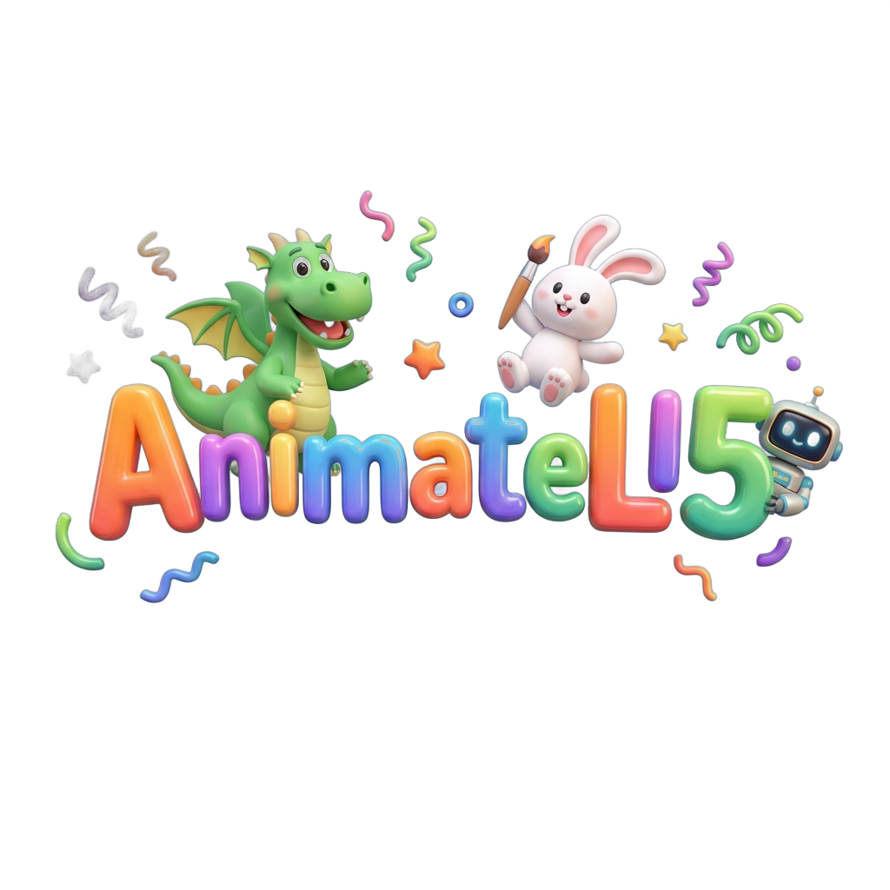
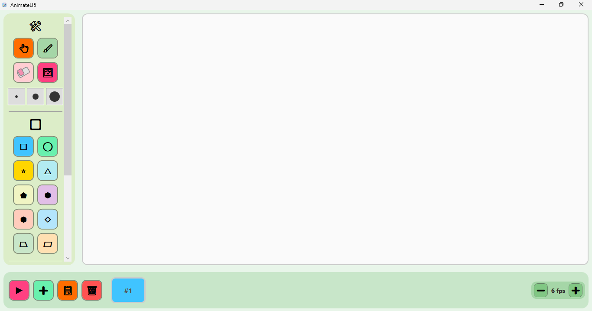

<p align="center">
  
</p>

<h1 align="center">AnimateLI5</h1>

<p align="center">
  <strong>An easy animation tool designed for kids ages 5+</strong><br>
  Big buttons. Bright colors. No reading required.
</p>

<p align="center">
  
  
  
</p>

<p align="center">
  <a href="https://youtu.be/fbgR41_aDBQ">
    
  </a>
</p>

---

## What is AnimateLI5?

AnimateLI5 is a Windows desktop app that lets very young children create frame-by-frame animations. Think **"finger-painting with motion."**

Every feature is designed to work without reading — large colorful buttons, drag-and-drop, editing, and exporting their animations.

### Features

- **10+ Shapes** — Rectangle, ellipse, star, triangle, pentagon, hexagon, heptagon, rhombus, trapezium, parallelogram
- **Freehand Drawing** — Brush tool with adjustable size and color
- **Eraser** — Circle-based element removal
- **Drag, Resize & Rotate** — Full manipulation of any element on the canvas
- **Frame Timeline** — Add, duplicate, and delete frames with a visual strip
- **Playback** — Preview animations at adjustable speed (1–30 FPS)
- **Stamp Library** — Drag & drop your own images as stickers
- **Undo / Redo** — Full undo history for every action
- **Video Export** — Export to MP4 via ffmpeg with a progress bar
- **Plugin System** — Extend functionality with drop-in DLLs

---

## Screenshots

<p align="center">
  
</p>

*The AnimateLI5 interface — large colorful tool buttons on the left, a spacious canvas in the center, and the frame timeline at the bottom. No menus, no text — just click and create.*

---

## Getting Started

### Requirements

- **Windows 10/11** (x64)
- **.NET 8 Runtime** (included if using the self-contained release)

### Option 1: Download Release

1. Go to the [Releases](../../releases) page
2. Download the latest `AnimateLI5-vX.X.X.zip`
3. Extract and run `AnimateLI5.exe`

### Option 2: Build from Source

```powershell
git clone https://github.com/n-92/AnimateLI5.git
cd AnimateLI5
dotnet restore
dotnet build
dotnet run --project src/SimpleAnimate
```

---

## Installing ffmpeg (for Video Export)

Video export requires **ffmpeg**. The app will auto-detect ffmpeg if it's on your system PATH, but you can also set it up manually.

### Step 1 — Download ffmpeg

Download the latest Windows build:

**[⬇ Download ffmpeg (win64-gpl-shared)](https://github.com/BtbN/FFmpeg-Builds/releases/download/latest/ffmpeg-master-latest-win64-gpl-shared.zip)**

### Step 2 — Extract

Extract the zip to a permanent location, for example:

```
C:\ffmpeg\
```

After extracting, you should have a folder structure like:

```
C:\ffmpeg\
  └── ffmpeg-master-latest-win64-gpl-shared\
        ├── bin\
        │   ├── ffmpeg.exe    ← this is what the app needs
        │   ├── ffprobe.exe
        │   └── ffplay.exe
        ├── lib\
        └── ...
```

### Step 3 — Add to PATH

1. Press **Win + S** and search for **"Environment Variables"**
2. Click **"Edit the system environment variables"**
3. Click **"Environment Variables..."**
4. Under **User variables**, select **Path** and click **Edit**
5. Click **New** and add the path to the `bin` folder:
   ```
   C:\ffmpeg\ffmpeg-master-latest-win64-gpl-shared\bin
   ```
6. Click **OK** on all dialogs
7. **Restart any open terminals** for the change to take effect

### Verify Installation

Open a new cmd or powershell terminal and run:

```powershell
ffmpeg -version
```

You should see version info. AnimateLI5 will now automatically detect ffmpeg and enable video export.

> **Note:** If you don't install ffmpeg, everything else works normally — you just won't be able to export MP4 videos.

---

## Project Structure

```
src/
  SimpleAnimate/              # WPF Application (thin shell — DI, views, controls)
    ViewModels/                # MVVM ViewModels
    Views/                     # XAML views & code-behind
    Converters/                # IValueConverter implementations
    Services/                  # FrameRenderer
    Assets/                    # Icons, splash logo
  SimpleAnimate.Core/          # Class library — models, interfaces, services (no WPF)
  SimpleAnimate.Plugins/       # Plugin infrastructure
plugins/                       # Drop-in plugin DLLs
tests/
  SimpleAnimate.Tests/         # xUnit tests
```

## Architecture

The solution follows **MVVM** with **CommunityToolkit.Mvvm** source generators and **Microsoft.Extensions.DependencyInjection**.

```
SimpleAnimate (WPF)  →  references Core + Plugins
SimpleAnimate.Plugins  →  references Core only
Any plugin  →  references Core only
SimpleAnimate.Core  →  references nothing (standalone)
```

ViewModels communicate via **C# events**. `MainViewModel` is the orchestrator that wires toolbar, canvas, and timeline together.

For full developer documentation, see [`docs/codebase-documentation.html`](docs/codebase-documentation.html).

---

## Tech Stack

| Component | Technology |
|-----------|-----------|
| Framework | WPF on .NET 8 |
| Language | C# 12 |
| MVVM | CommunityToolkit.Mvvm |
| DI | Microsoft.Extensions.DependencyInjection |
| Serialization | System.Text.Json (source-generated) |
| Video Export | ffmpeg (external) |
| Tests | xUnit |

---

## Running Tests

```powershell
dotnet test
```

---

## Building a Release

```powershell
dotnet publish src/SimpleAnimate -c Release -r win-x64 --self-contained `
  -p:PublishSingleFile=true `
  -p:IncludeNativeLibrariesForSelfExtract=true `
  -p:EnableCompressionInSingleFile=true `
  -p:DebugType=none
```

Output: `src/SimpleAnimate/bin/Release/net8.0-windows/win-x64/publish/AnimateLI5.exe`

---

## Contributing

Contributions are welcome! Please keep in mind:

- **UX first** — every feature must work without reading. Big targets, bright colors, audio feedback.
- **Core stays clean** — no WPF references in `SimpleAnimate.Core`
- **Use source generators** — `[ObservableProperty]` and `[RelayCommand]`, no manual INPC boilerplate
- **Undo everything** — every canvas mutation must go through the undo service

---

## License

This project is open source under the [MIT License](LICENSE).

---

<p align="center">
  Made with ❤️ for kids who love to create
</p>
